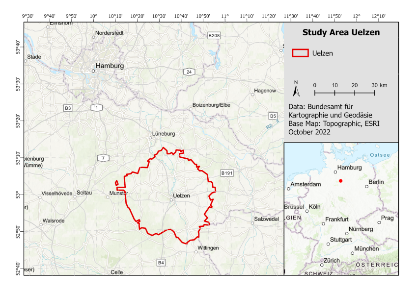

# Climate-Change-Adaptation-Lower-Saxony

## Introduction
This repository includes the tools and data used to perform a climate change adaptation analysis for agriculture in Uelzen, Germany (Figure 1). The outcomes of this analysis are detailed in the paper titled Resilient Agriculture: Water Management for Climate Change Adaptation in Lower Saxony, authored by Dr. Rodrigo Valencia Cotera, Dr. Sabine Egerer, Dr. Christine Nam, Ludwig Lierhammer, Lukas Moors, and Dr. María Máñez Costa. This paper underwent peer review and has been accepted by the Journal of Water and Climate Change of the International Water Association (IWA). Currently, it is undergoing the production process.

Certain modeling software, such as Vensim, have a limitation as they can only handle input data from a single dataset at a time, restricting it to perform only one simulation. This poses a significant challenge for impact models utilizing climate data, as impact analyses typically require ensemble climate data. To address this limitation, the Python library PySD was employed to execute and supply data to the model. PySD was specifically designed to facilitate the integration of data science and models created using Vensim (Houghton & Siegel, 2015).

## Whats contained in this repository
- An ensemble of Climate projections
- An impact model developed in Vensim
- The necessary scripts to execute a hydrological impact model developed using Vensim software.

## How to run the model

### Setup
The environment can be setup using either pip or pipenv. Make sure your environment is using python 3.9. This application and its dependancies were not tested for any other python version.

pip: `pip install -r requirements.txt`

pipenv: `pipenv sync`

### Run
`python run_model.py`

Or, alternatively, you can provide an integer argument to run this application with multiprocessing and speed it up:

`python run_model.py 8`

Either method will create a `plots` directory that is then populated with the plots also referenced in the accompanying publication.
